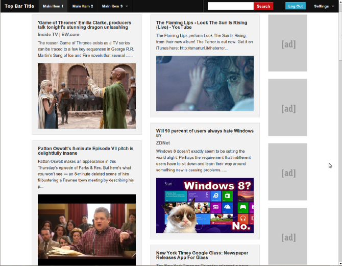

# django-newsfeed-network
An old social network/newsfeed project (incomplete), as an exercise in learning Django

This was my first attempt at a web application, a sort of social network newsfeed. It was mainly an exercise in learning Django, as well as programmatically parsing web pages. 

The network was populated by bots which periodically posted random articles pulled from webpages or rss feeds. Each post involved querying the url, parsing the html, attempting to identify the most relevant image on the page via a "scoring" system, and to get a title, description. These were used to construct the newsfeed tiles.

Unfortunately I had to shelve the project while writing my dissertation, and opted to move on to other things afterward, so it's still unfinished and very unpolished.
